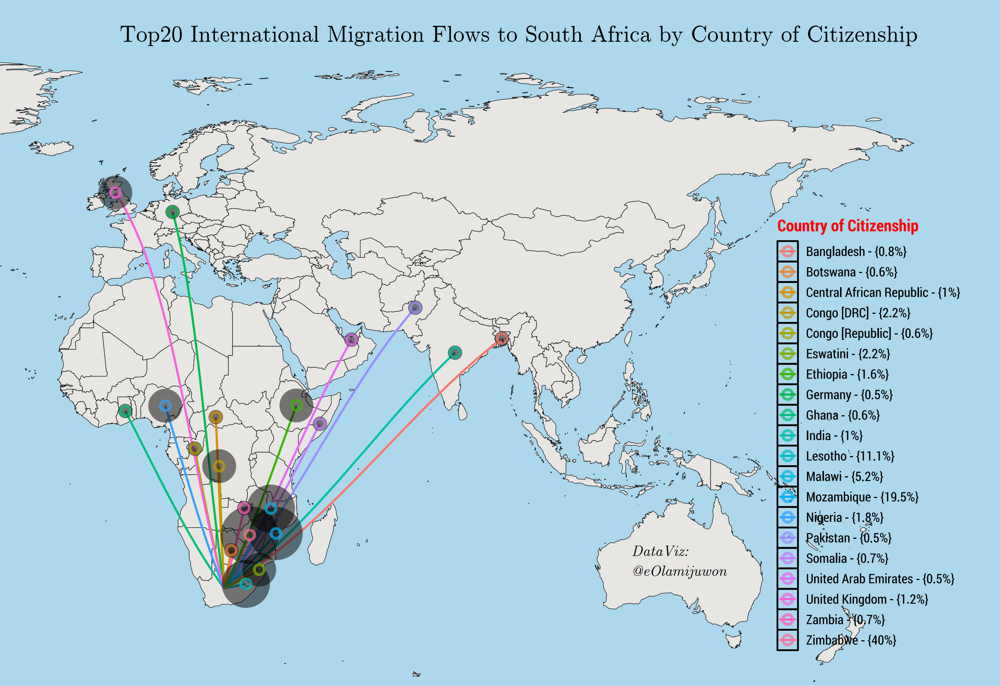

#


Visualizing top internation migration flows to South Africa using data from the 2016 community survey. Map and chart can be reproduced using the R code available [here](https://github.com/eolamijuwon/TidyTuesday/blob/master/migration_flows_ZA/Migration_flows_ZA.R)




 

Visualizing internal migration flows in South Africa using data from the 2016 community survey and `chorddiag` package with code adapted from [Data-to-Viz](https://www.data-to-viz.com/graph/chord.html). A reproducible code for the chart is available [here](https://github.com/eolamijuwon/TidyTuesday/blob/master/migration_flows_ZA/Migration_flows_ZA.R)


# Recap

- Install packages **(when required)**

- Load libraries at every fresh start

- Import dataset(s)

- View data structure

- Clean/manage dataset

- Descriptive statistics (comples surveys)


# Introduction to Data visualization in R

This chapter will teach you how to visualize your data using ggplot2. R has several systems for making graphs, but ggplot2 is one of the most elegant and most versatile. ggplot2 implements the grammar of graphics, a coherent system for describing and building graphs. With ggplot2, you can do more faster by learning one system and applying it in many places.

If you’d like to learn more about the theoretical underpinnings of ggplot2 before you start, I’d recommend reading “A Layered Grammar of Graphics”.

Prerequisites
This chapter focuses on ggplot2, one of the core members of the tidyverse. To access the datasets, help pages, and functions that we will use in this chapter, load the tidyverse by running this code:


# Impressive data visualization showcases [{tidytuesday}](https://nsgrantham.shinyapps.io/tidytuesdayrocks/), [{R-Graph Gallery}](https://www.r-graph-gallery.com/index.html)

 


# `ggplot2` Basics


There are three main plotting systems in R, the base plotting system `plot`, the `lattice` package, and the `ggplot2` package.

Here we will introduce the ggplot2 package, which has recently soared in popularity. ggplot allows you to create graphs for univariate and multivariate numerical and categorical data in a straightforward manner. It also allows for easy grouping and conditioning. It can generate complex plots create high quality graphics for publication.


A Graphing Template
Let’s turn this code into a reusable template for making graphs with ggplot2. To make a graph, replace the bracketed sections in the following code with a dataset, a geom function, or a collection of mappings:


```{r}

library(<tidyverse>ggplot2)

ggplot(data = <DATA>) +
  <GEOM_FUNCTION>(mapping = aes(<MAPPINGS>)) +
    <THEME_FUNCTION>() 

```
The rest of this chapter will show you how to complete and extend this template to make different types of graphs. We will begin with the <MAPPINGS> component.


### <DATA>


### <GEOM_FUNCTION>

Please see the `ggplot2` reference [website](https://ggplot2.tidyverse.org/reference/) for a full list of geoms_ and functions


-   `geom_bar`, `geom_col` for bar charts

-   `geom_boxplot()` for plotting a box and whiskers plot

-   `geom_dotplot()` for making dot plots

-   `geom_freqpoly()`, `geom_histogram()` for plotting histograms and frequency polygons

-   `geom_line()`, `geom_path()`, `geom_step()` for connecting observations

-   `geom_point()` for plotting points

	


### <MAPPINGS>


### THEME_FUNCTION


# `ggplot2` Extras - [Extensions](http://www.ggplot2-exts.org/gallery/)
sdfd

# Save/Export plots

fds

# Lab Exercises

sdf
